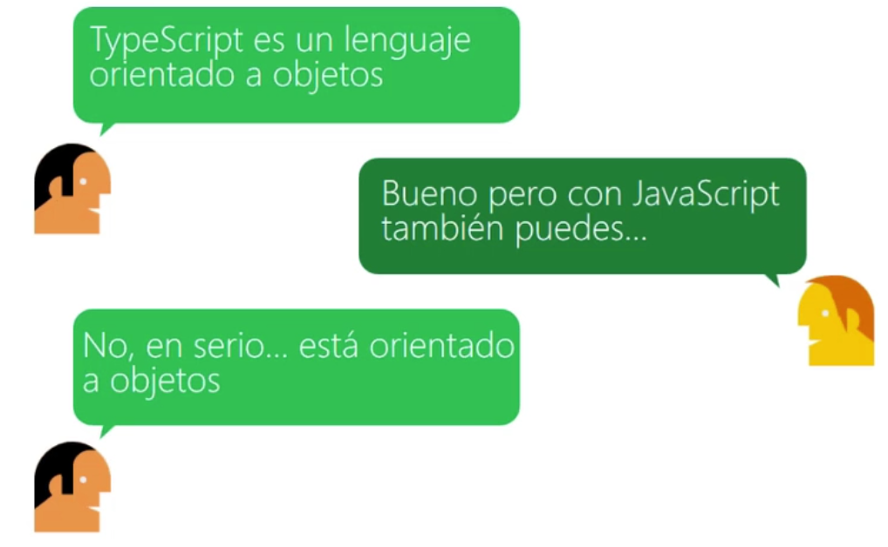
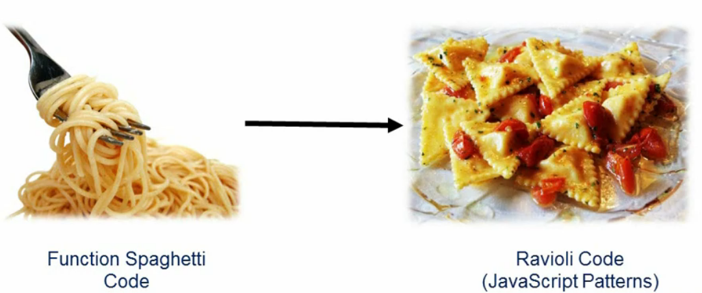
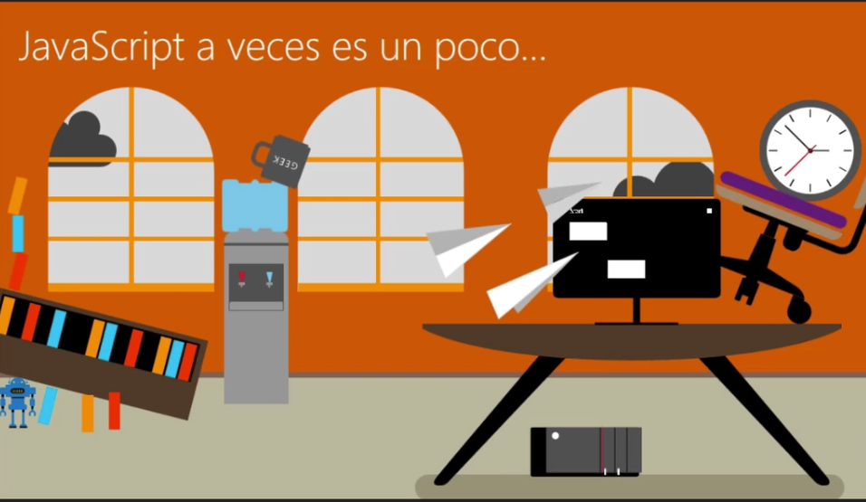
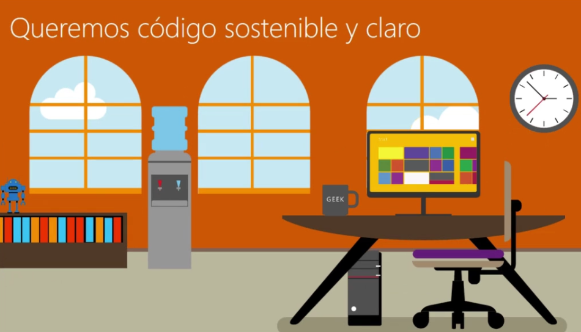
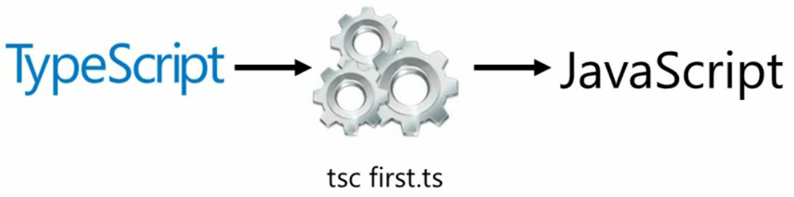
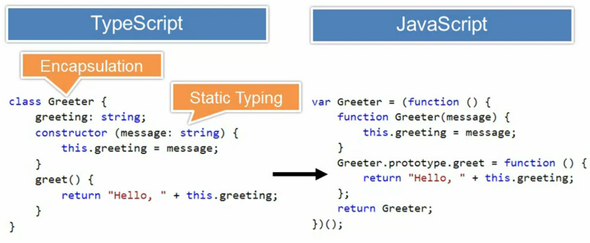

# Introducción

En la comunidad de javascript se han desarrollado un monton de herramientas

- Script de automatización
- Script de pruebas
- Frameworks 
- Librerias
- Lenguajes que se compilan a javascript
    - GWT
    - Typescript
    - Dart

## Javascript
- Javascript a veces puede ser desordenado por las variables dinamicas.
- Javascript actualmente ya es un lenguaje Orientado a Objetos
    - Implementado con sintaxis Sugar(Sencillo)    

- Si no se tiene codigo limpio no podra ser Mantenible ni Reutilizable.
- Con javascript se tiene que cambiar de hacer codigo spaguetti a 
- Encapsulación del codigo JavaScript.

- Javascript proporciona un sistema de tipo dinámico
    - El bueno
        - Las variables pueden contener cualquier objeto.
        - Tipos determinados sobre la marcha
        - Tipo de coerción implícita (ej .: strintg to number)
    - El malo
        - Difícil asegurar que se pasan los tipos adecuados sin pruebas.
        - No todos los desarrolladores usan ===
        - Las aplicaciones a escala empresarial pueden tener miles de líneas de código para mantener.

- **Representación de Javascript**
- Si no sigue algunos de los patrones de javascript para ordenar su codigo se vera de esta forma.


## Alternativas a TypeScript
- Escribir en puro javascript.
- Aplicar patrones a Javascript
- Dart
- kotlin
- CoofeScript

## Que es Typescript?

- Typescript es un lenguaje Orientado a Objetos pero de verdad y no como javascript porque javascript (Sugar)
- TypeScript es un tipo de superset de JavaScript que compila/genera/transpila a JavaScript simple.
    - **Nota** Todo el JS es TS valido
- Cualquier navegador
- Cualquier host
- Cualquier Sistema Operativo
- Proyecto muy activo de Open Source
- Tool support

## Caracteristicas    
- Usar Typescript no da la posibilidad de utilizar las nuevas caracteristicas de javascript, que no todo los navegadores lo pueden soportar.
- Proporciona tipos estaticos.
- Encapsulacion mediante clases y modulos.
- Soporte para constructores, propiedades y funciones en una Clase.
- Definicion de interfaces.
- Soporte de funciones Lambdas (=>). Muy util para funciones anonimas.
- Comprobación inteligente de la sintaxis. Por ejemplo el editor o IDEs te ayuda a saber que tipo de dato se esta mandando.
- Compilar Typescript


- Caracteristicas que no tiene javascript:
    - Decoradores
    - Genericos            
    - Comprobacion de sintaxis en tiempo Real
    - Programación orientada a Objetos
        - Encapsulacion de clases
            - private, public, protected
        - Encapsulacion de modulos        
        - Define interfaces
        - Polimorfismo en constructores y metodos
- Typescript es un nuevo lenguaje con caracteristicas pensadas para  proyectos grandes y a gran escala.

## Quienes utilizan Typescript
* Microsoft
* Google
* airbnb
* Shopify
* slack    
* medium
* 2393+ compañias utilizan TypeScript revisar: [https://stackshare.io/typescript](https://stackshare.io/typescript)
* En github 410000+ repositorio publicos lo utilizan revisar: [https://github.com/topics/typescript](https://github.com/topics/typescript)

## Por qué usar TypeScript?
- Utiliza programación Orientada a Objetos
- Potencia tu codigo Javascript.
- El desarrollador tendra una mejor productividad.
- Poderoso sistema de tipos
- Compila a ES5, ES6, etc.
- Actualizaciones periodicas
- Comunidad creciente
- Puede prevenir cerca del 15% de bugs mas con un lenguaje Tipado. puede revisar el estudio [aqui](http://ttendency.cs.ucl.ac.uk/projects/type_study/documents/type_study.pdf)
- Con TypeScript se puede utiliza en el frontend y backend.

## Herramientas
- Hay muchas herramientas que implementan Typescript y que nos agilizan y nos ayudan desarrollar mas rapido
    * Autocompletado
    * Detección de errores
    * Refactoring automatico
- Editores y IDE
    - Visual Studio Code
    - Atom
    - Web Storm 

## Angular
- Porque en Angular se utiliza Typescript.
    - [Victor Savking](https://vsavkin.com/writing-angular-2-in-typescript-1fa77c78d8e8)
    - **Resumen** Su punto principal es porque Typescript es mucho mas explicito con tipado estatico y claro que uno de tipado dinamico.

## Ejemplo
```
// Javascript
JQuery.ajax(url, settings);

// TypeScript
JQuery.ajax(url: string, settings?: JQueryAjaxSettings): JQueryXHR;
```
## Desventajas
- Para proyectos pequeños no es bueno usarlo porque se tardaria configurar o preparar el entorno para desarrollar tu applicacion.
- El que ya no tenga tipado dinamico pierda la flexibilidad que tiene javascript.
- La reutilizacion de variables
