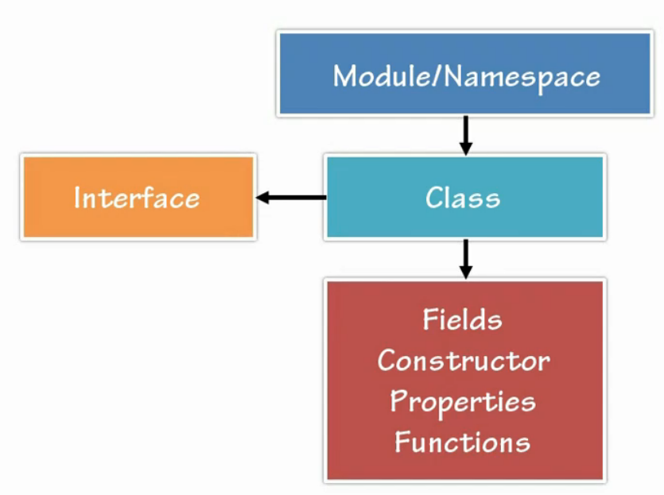

# Conceptos Basicos

## Reglas de sintaxis de TypeScript.
- TypeScript es un superset de JavaScript.
- Sigue algunas reglas de sintaxis.
    - {} Llaves define bloques de Codigo.
    - ; Para definar que una expresion de codigo termino.
- Keywords de javascript

## Importantes keywords y operadores.
| Keyword | Descripción |
|:--:| :--: |
| ... |  Parametros de sintaxis rest |
| : | Separador entre variables/parametros nombres y tipos |
| <typeName> | <> Caracter usado para convertir entre tipos. |
| => |  Sintaxis Arrow usado en definiciones y funciones|
| class       | Contenedores para miembros como propiedades y funciones.  |
| constructor | Para iniciar la funcionalidad de una clase |
| exports | Exportar un miembro de un modulo |
| extends | Utilizado para herencia |
| implements | Implementar una interfaz |
| imports | Importar un modulo |
| interface | Definir el contacto de código que se puede implementar por tipos |
| module/namespace | Almacenar clases y otros codigos |
| public/private | Modificadores de visibilidad de los miembros |

## Jerarquia del codigo en TypeScript


## Empezar a programar
- Ahora podemos empezar a programar con el playground que nos proporciona typescript
- [https://www.typescriptlang.org/play/index.html](https://www.typescriptlang.org/play/index.html)

O podemos utilizar repl para poder tambien probar nuestros proyectos.
- [https://repl.it](https://repl.it)

## Mi primer programa
**Ejecutar Servidor local**
```
http-server -o ejemplo1
```
**Transpilar TypeScript**
```bash
# -w: estar siempre escuchando
tsc -w
```
- [Ejemplo1](../examples/2-basic/ejemplo1/README.md)

## Archivo de Confiuración de TypeScript
```bash
## Generar el archivo de configuración
tsc --init
# Generar un projecto con el archivo de configuracion
tsc --project ejemplo2
```

- Archivo tsconfig.json
```json
{
  "compilerOptions": {
    /* Basic Options */
    "target": "es5",                          /* Specify ECMAScript target version: 'ES3' (default), 'ES5', 'ES2015', 'ES2016', 'ES2017','ES2018' or 'ESNEXT'. */
    "module": "commonjs",                     /* Specify module code generation: 'none', 'commonjs', 'amd', 'system', 'umd', 'es2015', or 'ESNext'. */
    // "lib": [],                             /* Specify library files to be included in the compilation. */
    // "allowJs": true,                       /* Allow javascript files to be compiled. */
    // "checkJs": true,                       /* Report errors in .js files. */
    // "jsx": "preserve",                     /* Specify JSX code generation: 'preserve', 'react-native', or 'react'. */
    // "declaration": true,                   /* Generates corresponding '.d.ts' file. */
    // "declarationMap": true,                /* Generates a sourcemap for each corresponding '.d.ts' file. */
    "sourceMap": true,                     /* Generates corresponding '.map' file. */
    // "outFile": "./",                       /* Concatenate and emit output to single file. */
     "outDir": "dist",                        /* Redirect output structure to the directory. */
    // "rootDir": "./",                       /* Specify the root directory of input files. Use to control the output directory structure with --outDir. */
    // "composite": true,                     /* Enable project compilation */
    // "removeComments": true,                /* Do not emit comments to output. */
    // "noEmit": true,                        /* Do not emit outputs. */
    // "importHelpers": true,                 /* Import emit helpers from 'tslib'. */
    // "downlevelIteration": true,            /* Provide full support for iterables in 'for-of', spread, and destructuring when targeting 'ES5' or 'ES3'. */
    // "isolatedModules": true,               /* Transpile each file as a separate module (similar to 'ts.transpileModule'). */

    /* Strict Type-Checking Options */
    "strict": true,                           /* Enable all strict type-checking options. */
    "noImplicitAny": true,                 /* Raise error on expressions and declarations with an implied 'any' type. */
    // "strictNullChecks": true,              /* Enable strict null checks. */
    // "strictFunctionTypes": true,           /* Enable strict checking of function types. */
    // "strictBindCallApply": true,           /* Enable strict 'bind', 'call', and 'apply' methods on functions. */
    // "strictPropertyInitialization": true,  /* Enable strict checking of property initialization in classes. */
    // "noImplicitThis": true,                /* Raise error on 'this' expressions with an implied 'any' type. */
    // "alwaysStrict": true,                  /* Parse in strict mode and emit "use strict" for each source file. */

    /* Additional Checks */
    // "noUnusedLocals": true,                /* Report errors on unused locals. */
    // "noUnusedParameters": true,            /* Report errors on unused parameters. */
    "noImplicitReturns": true,             /* Report error when not all code paths in function return a value. */
    // "noFallthroughCasesInSwitch": true,    /* Report errors for fallthrough cases in switch statement. */

    /* Module Resolution Options */
    // "moduleResolution": "node",            /* Specify module resolution strategy: 'node' (Node.js) or 'classic' (TypeScript pre-1.6). */
    // "baseUrl": "./",                       /* Base directory to resolve non-absolute module names. */
    // "paths": {},                           /* A series of entries which re-map imports to lookup locations relative to the 'baseUrl'. */
    // "rootDirs": [],                        /* List of root folders whose combined content represents the structure of the project at runtime. */
    // "typeRoots": [],                       /* List of folders to include type definitions from. */
    // "types": [],                           /* Type declaration files to be included in compilation. */
    // "allowSyntheticDefaultImports": true,  /* Allow default imports from modules with no default export. This does not affect code emit, just typechecking. */
    "esModuleInterop": true                   /* Enables emit interoperability between CommonJS and ES Modules via creation of namespace objects for all imports. Implies 'allowSyntheticDefaultImports'. */
    // "preserveSymlinks": true,              /* Do not resolve the real path of symlinks. */

    /* Source Map Options */
    // "sourceRoot": "",                      /* Specify the location where debugger should locate TypeScript files instead of source locations. */
    // "mapRoot": "",                         /* Specify the location where debugger should locate map files instead of generated locations. */
    // "inlineSourceMap": true,               /* Emit a single file with source maps instead of having a separate file. */
    // "inlineSources": true,                 /* Emit the source alongside the sourcemaps within a single file; requires '--inlineSourceMap' or '--sourceMap' to be set. */

    /* Experimental Options */
    // "experimentalDecorators": true,        /* Enables experimental support for ES7 decorators. */
    // "emitDecoratorMetadata": true,         /* Enables experimental support for emitting type metadata for decorators. */
  },
  "include": [
      // Lista de declaraciones de tipo que se van a incluir en el proceso de compilacion
      // Podemos mencionar los directorios y subdirectorios seran utilizan incluidos en el proceso de compilacion
      "src/**/*.ts"
  ],
  "exclude": [
      // Excluir los archivos que no se añadiran en la compilacion
      "node_modules",
      "**/*.test.ts"
  ]
}
```
- [Ejemplo2](../examples/2-basic/ejemplo2/README.md)

## Tipos de datos
- Tipado en TypeScript
    - **Explicito**: Define una sintaxis para la creación de variables con tipo de dato.
    - **Inferido**: TypeScript tiene la habilidad de deducir el tipo en función de un valor.
- Tipos de datos
    - number
        - Valores numericos
        - Valores flotantes
        - Valores hexadecimales
        - Valores binarios
        - Valores octales
    - string
    - boolean
    - Array<string>
    - number[]
    - enum

## Variables
- Para crear variables en TypeScript se utiliza el formato CamelCase
- Las variables tienen que tener nombre significativos
- Una variable no puedo comenzar por numeros
- Una variable no puedo contener espacios y tampoco simbolos especiales
- Una variable no deben ser keywords(palabras reservadas)
- Variables sin tipo
    - `var unVar = 4;`
    - `let unLet = "Good moorning;`
    - `const unConst = true;`
- Variable con tipo
    - `let unNumber:number = 4;`    
    - `let unString:string = "Sergio Ochoa";`
    - `let unBool:boolean = true;`
 - Variables dinamicas
    - `let unAny:any = 4.5;`
- [Ejemplo3](../examples/2-basic/ejemplo3/README.md)

## Funciones
1. [Ejemplo1](../examples/2-empezar/ejemplo3/README.md)
2. [Ejecutar](https://repl.it/@gnujavasergio/3funciones)


